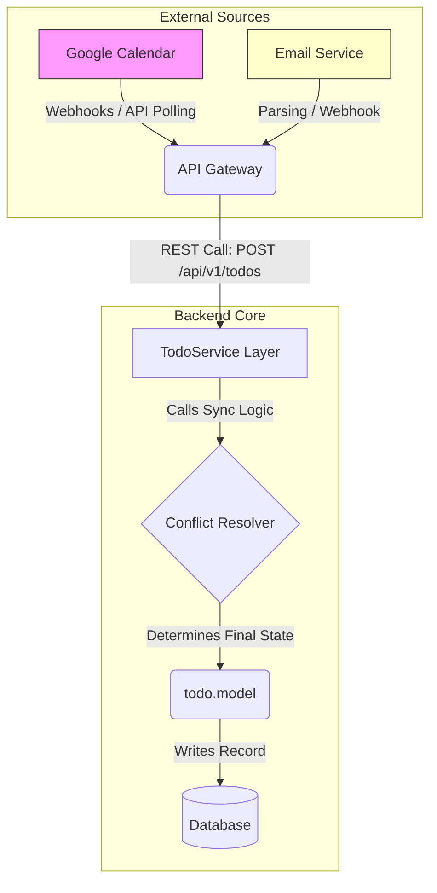

# Project Architecture Design Specification

## Overview
This document outlines the complete technical architecture for the Agenda application. It adheres to a modular, layered structure designed for scalability, maintainability, and local-first operation, ensuring data integrity across multiple synchronization sources (Calendar, Email, Manual).

## 1. High-Level System Flow
The system operates on a strict flow: **Client $\rightarrow$ API Gateway $\rightarrow$ Service Layer $\rightarrow$ Model/Database.** The Client is decoupled from the persistence layer, communicating only through defined REST APIs.

### Workflow Diagram: ToDo Synchronization (Mermaid)

## 2. Architectural Layers (Layered Pattern)
The backend is strictly separated into three layers:

### Layer 1: API Gateway / Routes (`src/routes/*`)
*   **Purpose:** Handles HTTP requests, performs initial input validation, and acts as the entry point for the business logic.
*   **Responsibility:** Translating HTTP verbs (GET, POST, PUT) into method calls on the Service Layer. It knows nothing about *how* to sync data, only that it must call a service function.

### Layer 2: Business Logic / Services (`src/services/*`)
*   **Purpose:** The heart of the application. Contains all rules, state management, and complex workflows (e.g., conflict resolution).
*   **Key Concept: Conflict Resolver:** Implements **Last Write Wins (LWW)** logic using the `updated_at` timestamp to resolve conflicts between local data and external sources.

### Layer 3: Data Access / Models (`src/models/*`)
*   **Purpose:** Defines the schema, handles ORM interactions (e.g., Sequelize calls), and enforces database constraints (Primary Keys, Foreign Keys).
*   **Technology:** Uses an Object-Relational Mapper (ORM) pattern to abstract SQL queries.

## 3. Local First Architecture (LFA)
The system is designed to function offline seamlessly:
1.  All data synchronization happens in the background (`src/services/*.js`).
2.  When offline, the application reads directly from the local ORM models, providing instant UI feedback.
3.  Synchronization only runs when connectivity is restored, using the LWW logic defined above to merge changes safely.

## 4. Technology Stack Summary
*   **Frontend:** React (TypeScript) + Vite
*   **Desktop Wrapper:** Electron (Node.js/Browser Integration)
*   **Backend:** Express.js / Node.js
*   **Database Layer:** Sequelize ORM or similar robust system.

***END OF DOCUMENT***